# securityButler

>  手机安全卫士 适用Android 8.0 版本的开发版

## 一、 开发背景

### 1.1、 市场背景

根据国家互联网应急中心在2019年12月13日的[2019年第三季度国内操作系统及浏览器占比情况分析](https://www.cert.org.cn/publish/main/68/2019/20191213093128213770979/20191213093128213770979_.html)报告，在国内使用移动端上网的用户数量已经超过使用PC端上网的用户数量。在移动端操作系统中，Android操作系统的占比永远大于使用IOS操作系统，Android设备占比78.2%，IOS占比21%,其他移动操作系统占比0.05%。在Android的操作系统中。超过一半的Android用户的操作系统更新至Android 9、Android 8.1和Android 8.0，不同的版本使用的用户占比如图 1-1-1 所示。这当然离不开Android的不断更新和完善，不断的增强系统安全意识和用户的隐私保护。

​     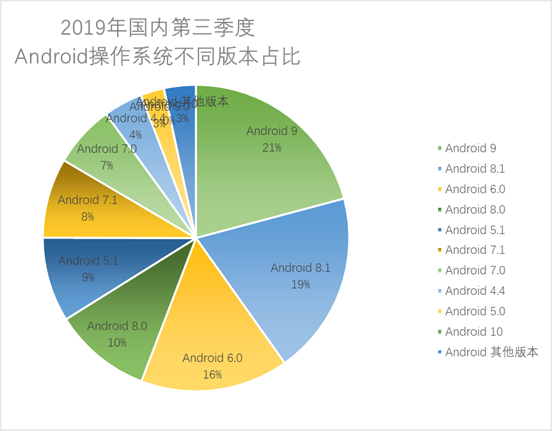

图 1-1-1

​    在Android的设备生产厂商中，华为用户占比最高，到35.70%，其次的就是OPPO手机用户占比达到21.52%，相继而下的是VIVO手机用户，在那比21.33%，小米手机用户占比7.39%，其他厂商的设备占比在5.85%。

​    基于Android平台优势：开发优势、丰富的硬件、方便开发和Google应用等其他服务。也是基于这种优势的条件下，Android 操作系统的用户同样的有很多的烦恼，比如手机安全方面。

​    在Android的应用市场上当然有很多的手机安全管理的应用，相比之下，手机卫士可以申请到更高的设备权限，保证手机更高的安全。

​    手机卫士就是为了Android设备的安全和防护而开发的应用程序。主要为用户提供：1、手机防盗功能，在用户手机丢失时候为用户发送报警信息到紧急联系人中，紧急联系人可以通过防盗指令向手机发送短信指令，播放报警音乐、报告手机位置信息、远程锁屏并且更换密码和远程删除手机设备数据。2、为用户不断的升级应用程序，在用户启动手机卫士的应用程序的时候，自动的检查手机卫士应用程序是不是最新版，发送通知提示用户更新应用。3、自动的检查手机环境，当用户打开应用的时候为用户检查手机的安全性。4、应用程序管理，管理当前手机所APP应用程序管理，让用更方便的运行、分享和卸载。

 

### 1.2、 技术背景

Android 操作系统的内核是Linux内核的长期分支，具有Linux内核调度和功能，在Linux内核上，有些C语言所写的中间件、函数库和应用程序接口，以及包含Java兼容库的应用框架上应用程序。Linux内核的开发则继续独立于Android的其他源代码项目。截至5.0版本，Android利用Dalvik虚拟机作为程序虚拟机，它与实时的跟踪编译（JIT）来运行Dalvik“DEX-代码”（Dalvik的可执行程序），这通常是由Java字节码一同翻译而来。继基于跟踪的JIT的原则，除了解读大多数应用程序代码外，Dalvik运行编译及每当应用程序引导时，选择本机运行的频繁运行代码段。Android 4.4引入Android Runtime（ART）作为新的运作环境，在安装应用程序时，它会使用提前编译（AOT）来把应用程序字节码完全编译为机器语言。在Android 4.4中，ART是一项实验性功能，默认情况下不激活；它成为Android 5.0的下一个主要版本中唯一的运作选项。2015年12月，Google宣布Android的下一个版本将会切换到基于OpenJDK项目的Java实行方式。2016年5月20日，Google在Google I/O上表示，将会把 Google Play商店和Android App带到Chrome OS中，使Chrome OS可以运行Android APP增加推行Chromebook和Chromebox的动力，解决该平台应用程序不足的问题；此外Chromebook在美国市场出货量已经超越苹果Mac。

Android 5+ 版本

| **名称**                | **版本号** | **发行时间** | **API等级** | **Linux内核版本** | **安全性** |
| ----------------------- | ---------- | ------------ | ----------- | ----------------- | ---------- |
| **Android Lollipop**    | 5.0–5.1.1  | 2.14-11-12   | 21-22       | 3.16.1            | 不支持     |
| **Android Marshmallow** | 6.0–6.0.1  | 2015-10-5    | 23          | 3.18.10           | 不支持     |
| **Android Nougat**      | 7.0–7.1.2  | 2016-8-22    | 24-25       | 4.4.1             | 不支持     |
| **Android Oreo**        | 8.0–8.1    | 2017-8-21    | 26-27       | 4.9               | 支持       |
| **Android Pie**         | 9          | 2018-8-6     | 28          | 4.14              | 支持       |
| **Android 10**          | 10         | 2019-9-3     | 29          | 5.0               | 支持       |
| **Android 11**          | 11         | 2020-2-19    | 30          |                   | 支持       |

 

​    在Android marshmallow中增加全新的权限机制，针对 Android 6.0 及以上系统版本开发的应用程序在使用敏感权限（如拍照、查阅联系人或短信）时需要先征求用户同意。在Android 10 中对折叠式智能手机的原生支持、允许用户控制应用程序何时有权查所在位置、新增控制应用程序在后台时的照片、影片和音乐文件的访问权限、增加对后台应用程序自动唤醒到前台的限制、隐私改进：限制对IMEI码的读取。

 

## 二、 需求分析

### 2.1、程序顶层需求结构

​    手机卫士的主要功能有：1、手机环境检查，检查应用程序是否可以更新和检查手机是否开启防盗功能。2、手机防盗功能，包括绑定SIM卡、绑定紧急联系人、SIM卡变更报警、发送位置信息、播放报警音乐、远程锁屏、远程删除数据。3、应用更新，检查更新和下载APK。4、APP应用管理，获取非系统应用、运行APP、分享APP、卸载APP。如图2-1-1所示。

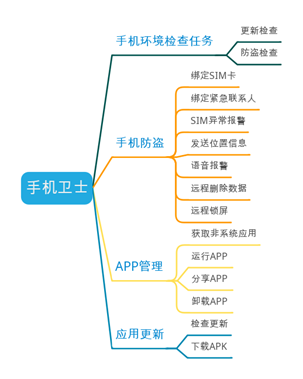

图 2-1-1

### 2.2、系统功能模块分析

#### 2.2.1、启动模块

​    在程序启动的时候，展示程序形象的设计没报，然后有一个倒数跳过的按钮在右上。可以让用户不想看海报的情况下跳过当前的界面。在倒数的时候防止用户在MainActivity退出的时候，还能自启HomeActivity。

 


图 2-2-1-1

 

#### 2.2.2、主界面模块

​    在程序的主界面展示一个环境检查的评分，在评分下面，是一个可以时时更新显示环境检查的某个阶段的任务执行详情。下面的某个模块显示采用瀑布流的方式显示某个功能模块，当用户点击模块的时候就能直接进入。但是不会影响检查任务。如图2-2-2-1所示。

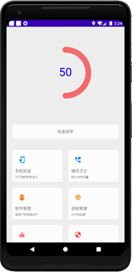

图 2-2-2-1

#### 2.2.3、检查环境模块

​    在主模块发起的环境检查，将检查到的手机安全受到危险的时候，某个检查模块都把消息通过系统通知的方式通知用户和引导用户去处理见面，处理问题。每个检查模块都是独立的一个任务，每个任务执行完都会打分给检查任务队列，在由任务队列综合评分返回给用户。通知如图 2-2-3-1 所示

 

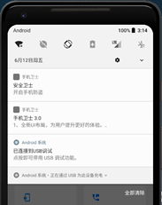

图 2-2-3-1

#### 2.2.4、检查更新任务与更新模块

​    展示程序的Log和展示最新版本的介绍，当用户点击一个更新版本的时候，下载时候在下面显示一个进度条。当用点击下载完成后，把按钮改成安装，点击的时候打开文件管理器到下载目录，让用户手动安装。如图 2-2-4-1 所示


图 2-2-4-1 所示

#### 2.2.4、手机防盗模块

​    在防盗见面介绍防盗的指令和开启关闭防盗的开关，当开启防盗的时候显示一个设置防盗的按钮，没有开启超级管理员的时候显示按钮点击前往开启超级管理员。开启防盗后，每一次进入当前的界面的时候都需要输入密码。

​    进入防盗引导界面的第一页引导的时候，展示防盗功能的介绍，当SIM卡变化，发送报警短信给紧急联系人，通过紧急联系人发送短信实现播放报警音乐、GPS定位追踪、远程删除手机数据和远程锁屏。防盗引导的第二个页面点击开启的时候初始化防盗密码。关闭的时候也是要输入。防盗引导第三个界面的时候，点击联系人图标进入选择人界面。选择完成的时候进行展示。

 

    

图 2.-2-4-1 所示

#### 2.2.5、选择联系人模块

​    选择联系人界面，权限授权检查，申请权限。再获取系统的联系人，在当前界面进行展示，用户可以点击条目或者点击选择框进行选择多个联系人。点击启动的时候返回选择的联系人数据。如图 2-2-5 所示

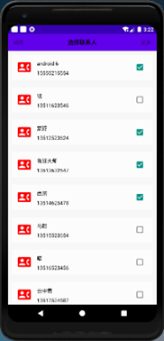

图 2-2-5-1

 

#### 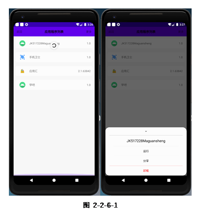2.2.6、应用程序管理模块

​    程序管理模块，管理的是非系统安装的应用程序。进入的时候我们会显示一个刷新的状态。等后台任务获取完非系统应用的时候，停止刷新，更新应用程序列表。点击应用的时候在下面弹出一个对话框，提供用户运行、分享和卸载功能。

​    当用户下拉的时候，从新刷新列表。

 

 


 

## 三、 程序总体设计

### 3.1、开发技术简介

​    在Android开发中主要的开发语言有Java和Kotlin，Java是一门大众化的编程语言，易学易用。在若干了领域都有很强的竞争力，比如服务端编程，高性能网络程序，企业软件事务处理，分布式计算，Android 移动终端应用开发等等。所以本次开发选择Java 8开发。

​    Android studio是Android开发中开发者比较喜欢的一款开发工具，很多人青睐这个IDE，我们采用Android studio 3.5.6版本进行开发。

​    Android 8 是市场使用率和版本上下兼容比较好的的

​    版本控制工具使用GitHub仓库，能方便的满足我们的需求。在开发前我们想创建好仓库地址。https://github.com/shaoyayu/securityButler；

### 3.2、程序设计用例分析

​    程序提供四个服务，环境检查、更新程序、手机防盗和APP管理。主要包括更新检查、防盗检查、下载APP、绑定SIM卡、绑定紧急联系人、发送报警短信、发送手机定位、播放报警音乐、远程删除数据、远程锁屏、运行非系统APP、分享APP、卸载app。用例图如图 3-2-1 所示

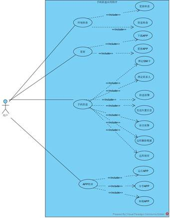

图 3-2-1

 

### 3.3、程序功能模块分析

#### 3.3.1、启动设计分析

​    在程序启动和时候展示自己的程序的特色宣传外，在主页上出现一个倒计时，在倒计时结束后或点击跳过倒计时，就可以进入HomeActivity了。

​    开启一个线程倒计时线程，通过Handler 与UI线程进行交互。在主线程中标价一个是否可以进入HomeActivity的标记，在用户点击跳过或者倒计时结束的时候，可以进入下一个活动，当用户在MainActivity退出后，重置标记为不可进入，防止倒数线程结束用户在另一个程序中被强制性进入本程序的HomeActivity。流程图如下 3-4-1

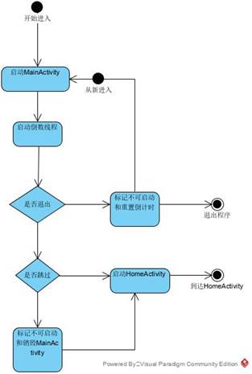

图 3-4-1

 

#### 3.3.2、主界面设计分析

​    在主界面的是启动检查任务队列，实现检查任务队列的回调方法，提供一个可展示可展示任务进度的TextView来展示信息。如图图 3-3-2-1所示

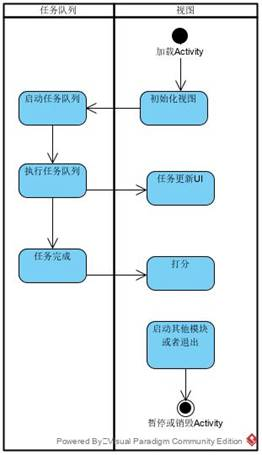

图 3-3-2-1

#### 3.3.3、检查任务设计分析

​       当检查环境任务队列被启动的时候，会执行从前到后的执行每个任务，每个任务都是独立的，在创建任务的时候传递一个Activity和一个TextView任务，每个任务耗时检查的时候会更新UI来提示当前检查手机安全的那个模块，每个任务执行完的时候会给任务队列打分。任务队列的任务执行完的时候，会回调的方式来总评分传递过去。如图图 3-3-3-1所示。

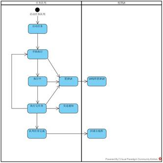

图 3-3-3-1

 

#### 3.3.4、更新设计分析

​    用户可以通过通知进入更新界面，点击更新，发起一个下载任务，在下载任务中，在页面上更新下载进度条。当下载完成，把更新按钮改成安装按钮。文件系统会打开到APP下载的路径下面。点击APK进行安装

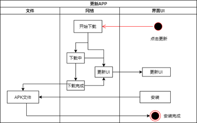

图 3-4-1

#### 3.3.4、手机防盗设计分析

​    手机防盗主要分为三个触发事件，一个是设置好手机防盗，流程图如 3-3-4-1所示。而是开机广播时候检查SIM卡是否发送改变，如图 3-3-4-2。三是短信广播检查是否紧急联系人的短信指令，如图3-3-4-3所示

 

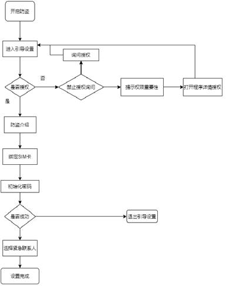

图 3-3-4-1

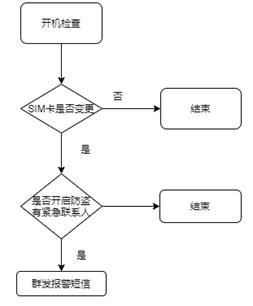

图 3-3-4-2

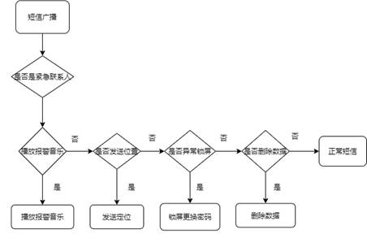

图 3-3-4-3

 

#### 3.3.5、APP管理设计分析

​    APP管理进入的时候，后台任务会读取非手机应用APP到见面上展示，用户可以点击app条目，弹出运行、分享和卸载的对话框。点击就可以执行了。流程图如图 3-3-5-1所示。

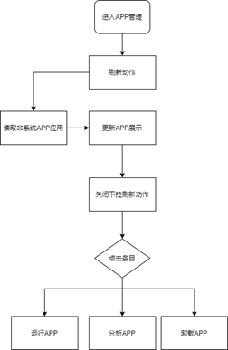

图 3-3-5-1

## 四、 详细设计和实现

### 4.1、包管理和依赖管理

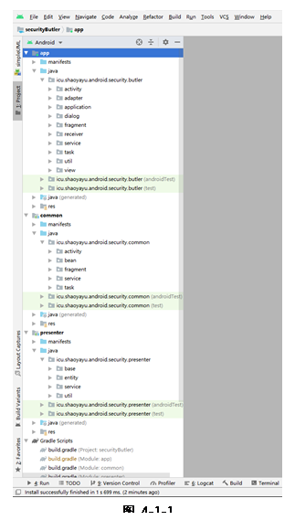    

程序分为三个模块：app模块、common模块和presenter。

APP模块是应用程序启动和界面的模块。App模块依赖有：common模块（抽象应用中的方法和分离公用的方法封装）、presenter模块(提供app模块的服务)、recyclerview依赖（RecycleView控件）、easypermissions依赖（权限管理框架）。

​    Common模块是定义程序中的自定义Activity和Fragment等其他视图的公用抽象。定义接口和规范。

​    Presenter模块主要的是为app模块提供服务，如获取系统联系人，存储联系人、数据持久化和网络交互等。Presenter主要的依赖有：okhttp3依赖（提供网络请求的框架）、common模块（提供接口与APP模块进行交互）

 

 


 

 

### 4.2、公用模块的实现

#### 4.2.1、公用Activity模块

​    在common模块中的CustomizActivity，在这个类中定义好一个公用的Activity，实现系统中Activity的初始化视图、数据传递检验、初始控件绑定、初始化数据、控件注册监听器、Activity对Fragment的管理、日志打印需要的TAG初始化和常用Toast方法封装，让子类继承实现。

```java
package icu.shaoyayu.android.security.common.activity;

import android.os.Bundle;
……
import icu.shaoyayu.android.security.common.fragment.CustomizeFragment;

/**
 * @author shaoyayu
 * Anima
 */
public abstract class CustomizeActivity extends AppCompatActivity implements MyActivityBase {

    protected String  TAG ;

    /**
     * 防止重写
     * @param savedInstanceState
     */
    @Override
    protected final void onCreate(@Nullable Bundle savedInstanceState) {
        super.onCreate(savedInstanceState);
        TAG = getClass().getName();
        //初始化窗口
        initWindows();
        if(initArgs(getIntent().getExtras())){
            //初始化数据成功 initialized data successfully
            int layId = getInterfaceResourceId();
            setContentView(layId);
            initTheControl();
            initData();
            initControlBinding();
        }else {
            //
            finish();
        }

    }

    /**
     * 初始化窗口
     * initialization window
     */
    protected abstract void initWindows();

    /**
     * 初始化的数据是不是正确
     * is the initialized data correct
     * @param bundle 携带的参数 parameters carried
     * @return 参数正确返回true parameters return true correctly
     */
    protected boolean initArgs(Bundle bundle){
        return true;
    }

    /**
     * 获取见面的资源id
     * get meeting resource id
     * @return
     */
    protected abstract int getInterfaceResourceId();

    /**
     * 初始化控件
     * Initialize the control
     */
    protected void initTheControl(){

    }


    /**
     * 初始化数据
     * initialization data
     */
    protected void initData(){

    }

    /**
     * 初始化控件的事件绑定
     * initialize the event binding of the control
     */
    protected void initControlBinding(){

    }

    /**
     * 导航上的返回事件
     * return event on navigation
     * @return
     */
    @Override
    public boolean onSupportNavigateUp() {
        finish();
        return super.onSupportNavigateUp();
    }

    /**
     * 主要管理activity上的fragment的生命周期
     */
    @Override
    public void onBackPressed() {
        super.onBackPressed();
        //得到当前activity下面的所有fragment
        List<Fragment> fragments = getSupportFragmentManager().getFragments();
        if (fragments!=null&&fragments.size()!=0){
            for (Fragment fragment : fragments) {
                //是不是自定义的fragment
                if (fragment instanceof CustomizeFragment){
                    //是否拦截了返回按钮的事假
                    if (((CustomizeFragment) fragment).onBackPressed()){
                        return;
                    }
                }
            }
        }
        finish();
    }

    /**
     * 子类可以直接使用的Toast
     * @param text
     */
    protected void showToast(CharSequence text){
        Toast.makeText(getApplicationContext(), text, Toast.LENGTH_SHORT).show();
    }
}

```

 

#### 4.2.2、公用Fragment模块

​    在common的模块中，写一个自定义的Fragment，来管理程序开发所需的Fragment中常用的方法进行封装、Fragment与Activity的交互和生命周期的管理。

 

```java
package icu.shaoyayu.android.security.common.fragment;

import android.content.Context;
……
import androidx.fragment.app.Fragment;

/**
 * @author shaoyayu
 * 自定义Fragment
 */
public abstract class CustomizeFragment extends Fragment implements MyFragment {

    protected View mRoot;
    protected String TAG;
    @Override
    public void onAttach(@NonNull Context context) {
        super.onAttach(context);
        initArgs(getArguments());
    }

    @Nullable
    @Override
    public View onCreateView(@NonNull LayoutInflater inflater, @Nullable ViewGroup container, @Nullable Bundle savedInstanceState) {
        TAG = getClass().getName();
        if (mRoot==null){
            int layId = getInterfaceResourceId();
            //初始化当前的根布局，但是不在创建的时候添加到 container 中，
            this.mRoot = inflater.inflate(layId,container,false);
            initTheControl(mRoot);
        }else {
            if (mRoot.getParent()!=null){
                //把当前的root从父布局中移除
                ((ViewGroup)mRoot.getParent()).removeView(mRoot);
            }
        }
        return mRoot;
    }

    /**
     * 界面初始化完成
     * @param view
     * @param savedInstanceState
     */
    @Override
    public void onViewCreated(@NonNull View view, @Nullable Bundle savedInstanceState) {
        super.onViewCreated(view, savedInstanceState);
        initData();
        initControlBinding();
    }

    /**
     * 初始化的数据是不是正确
     * is the initialized data correct
     * @param bundle 携带的参数 parameters carried
     * @return 参数正确返回true parameters return true correctly
     */
    protected void initArgs(Bundle bundle){

    }

    /**
     * 获取见面的资源id
     * get meeting resource id
     * @return
     */
    protected abstract int getInterfaceResourceId();


    /**
     * 初始化控件
     * Initialize the control
     */
    protected void initTheControl(View view){

    }

    /**
     * 初始化数据
     * initialization data
     */
    protected void initData(){

    }

    /**
     * 初始化控件的事件绑定
     * initialize the event binding of the control
     */
    protected void initControlBinding(){

    }

    /**
     * 返回按键触发时候调用
     * @return true 代表当前的Fragment 已经处理逻辑 activity 不用finish
     *          false 代表没有处理
     */
    public boolean onBackPressed(){
        return false;
    }

    /**
     * 子类可以直接使用的Toast
     * @param text
     */
    protected void showToast(CharSequence text){
        Toast.makeText(getContext(), text, Toast.LENGTH_SHORT).show();
    }
}

```

 

#### 4.2.3、公用菜单模块

​    自定义的简单菜单SimpleMenu控件，如图 4-1-3-1所示，背景颜色和系统的当前APP的colorPrimary颜色保持一致，这样在刘海屏或者全面屏的手机中都能有很好的显示效果。更为重要的是控件中能做的是事情，可以在Activity中使用控件的setComeBackText(CharSequence text)方法自定义tvMenuBacktrack返回的文字，可以自定义一个点击返回控件的setOnMoreClickListener(OnMoreClickListener onMoreClickListener)方法，加入你点击返回的时候希望能够给上一个Activity传递参数，就可通过这个方法实现，在没有给控件注册返回事件的点击回调方法时候，点击返回会默认的退出当期的Activity。可以通过setTvMenuThemeText(CharSequence tvMenuThemeText)方法，自定义一个菜单的主题介绍。更多的控件用法与返回控件一样。

​    

  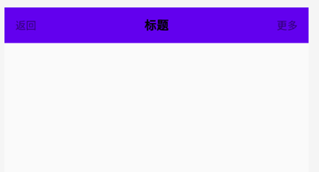  

如图 4-1-3-1所示  

 

布局代码：[layout_simple_menu.xml](https://github.com/shaoyayu/securityButler/blob/master/app/src/main/res/layout/layout_simple_menu.xml)

View代码：[SimpleMenu.java ](https://github.com/shaoyayu/securityButler/blob/master/app/src/main/java/icu/shaoyayu/android/security/butler/view/SimpleMenu.java)

#### 4.2.4、公用检查任务模块

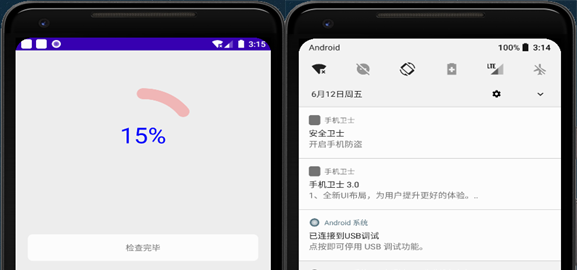    

在app启动主见面HomeActivity的时候，程序会自动检查当前的设备安全与程序是否有更新的情况，这个时候我们就需要一个异步任务去完成，这里选择使用异步任务AsyncTask而不使用Service，是因为AsyncTask的UI交互能力比Service的好，为用户提供一个更加直观的检查方式。异步检查任务的执行完后，每个检查任务CheckTheEnvironTask会返回一个检查环境的评分结果交个异步检查任务队列，检查任务通过NotificationManager通知用户当前的环境问题，最后任务检查队列执行完任务后作出评分综合返回给Activity。

任务Task封装

 

```java
package icu.shaoyayu.android.security.common.task;

import java.util.Map;

/**
 * @author shaoyayu
 * 任务的方法
 */
public interface Task{
    //任务名称
    String getTaskName();

    //开始执行任务
    void startTask();

    //执行的任务
    void run(InspectionTask task);

    //更新任务UI的回调
    void updateView(Map<String,Object>... values);

    //完成当前任务的回调
    void endTask();

    //最终任务评分
    int taskScoring();
}


```

 

环境检查任务CheckTheEnvironTask的封装

```java
package icu.shaoyayu.android.security.butler.task;

import icu.shaoyayu.android.security.common.task.Task;

/**
 * @author shaoyayu
 * home检查运行环境的任务
 *
 */
public abstract class CheckTheEnvironTask implements Task {

}


```

 

检查环境的异步任务队列InspectionTask

```java
package icu.shaoyayu.android.security.common.task;

import android.os.AsyncTask;

import java.util.Map;

/**
 * @author shaoyayu
 * 检查后台任务，
 * 包括，后台更新、防盗检查等其他的检查，
 */
public class InspectionTask  extends AsyncTask<Task, Map<String,Object>,Map<String,Object>> {

    //所有任务集和
    private Task[] taskStack;
    //监听任务的当前实在那个阶段
    private TaskStatus onStatus;
    //当前任务栈的任务索引
    private int taskIndex;

    private int[] marks;

    public void setOnStatus(TaskStatus status) {
        this.onStatus = status;
    }

    /**
     * 认为开始的时候
     */
    @Override
    protected void onPreExecute() {
        super.onPreExecute();
        if (onStatus!=null){
            onStatus.onStartOverallTask();
        }
    }

    /**
     * 执行的耗时任务
     * @param tasks
     * @return
     */
    @Override
    protected Map<String, Object> doInBackground(Task... tasks) {
        if (onStatus!=null){
            onStatus.onNormalOverallTask();
        }
        this.taskStack = tasks;
        marks = new int[taskStack.length];
        for (int i = 0; i < taskStack.length; i++) {
            taskStack[i].startTask();
            taskIndex = i;
            taskStack[i].run(this);
            taskStack[i].endTask();
            //获取前任务结束后的任务评分
            marks[i] = taskStack[i].taskScoring();
        }
        return null;
    }

    /**
     * 更新UI的任务
     * @param values
     */
    @Override
    public void onProgressUpdate(Map<String, Object>... values) {
        super.onProgressUpdate(values);
        taskStack[taskIndex].updateView(values);
    }

    /**
     * 任务执行完毕以后
     * @param stringObjectMap
     */
    @Override
    protected void onPostExecute(Map<String, Object> stringObjectMap) {
        super.onPostExecute(stringObjectMap);
        if (onStatus!=null){
            //计算评分
            double weight = (100/marks.length) * 0.01;
            double sum = 0;
            for (int mark : marks) {
                sum = sum + mark*weight;
            }
            onStatus.onBackOverallTask((int)sum);
            onStatus.onGetAllRatings(marks);
        }
    }

    public interface TaskStatus{
        void onStartOverallTask();
        void onNormalOverallTask();
        void onBackOverallTask(int finalRating);
        void onGetAllRatings(int... allRatings);
    }
}


```

 

#### 4.2.5、公用选择联系人模块

​    选择联系人是有个独立的模块，当你启动这个AddressBookActivity，会检查你是否授权读取联系人，如果你没有授权并没有选择不再提示权限的情况下，会弹出一个对话框动态的询问你是否授权，如果没有授权或选择不再提醒授权的情况下，会弹出一个对话框引导你去程序应用详情里面去授权应用读取联系人的权限。在确定按钮上注册一个监听器SimpleMenu.OnReturnClickListener，当选择联系人完成后，点击确定，直接通过ContactAdapter的getSelectedContact()方法拿到当前适配器下面选择的联系人。

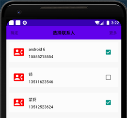

图 4-1-5-1

AddressBookActivity代码：

布局代码：[activity_address_book.xml](https://github.com/shaoyayu/securityButler/blob/master/app/src/main/res/layout/activity_address_book.xml)

Activity代码：[AddressBookActivity.java](https://github.com/shaoyayu/securityButler/blob/master/app/src/main/java/icu/shaoyayu/android/security/butler/activity/AddressBookActivity.java)

使用RecyclerView的ContactAdapter适配器代码：[ContactAdapter.java](https://github.com/shaoyayu/securityButler/blob/master/app/src/main/java/icu/shaoyayu/android/security/butler/adapter/ContactAdapter.java)

适配器中的布局代码：[adapter_address_boot_item.xml](https://github.com/shaoyayu/securityButler/blob/master/app/src/main/res/layout/adapter_address_boot_item.xml)

 

### 4.3、启动模块的实现

​    启动程序第一个看到的MainActivity，在这里程序只需要做好启动倒计时任务就行，不需要执行任何的任务，让用户有更好的体验。这里主要在倒数进下一个HomeActivity，当用户点击跳过倒计时，在启动HomeActivity前标记已经启动，防止线程倒数结束后再次启动HomeActivity，当用户在离开MainActivity的时候有需要标记不可以启动HomeActivity，防用户不在当前程序的时候，线程结束会直接跳转HomeActivity的这种错误。在界面上需要显示当前的APP应用程序的版本。


Activity代码：[MainActivity.java](https://github.com/shaoyayu/securityButler/blob/master/app/src/main/java/icu/shaoyayu/android/security/butler/activity/MainActivity.java)

Layout代码：[activity_main.xml](https://github.com/shaoyayu/securityButler/blob/master/app/src/main/res/layout/activity_main.xml)

 

### 4.4、系统检查模块的实现

#### 4.4.1、UpdateCheckTask

应用程序更新检查任务UpdateCheckTask

 

```java
package icu.shaoyayu.android.security.butler.task;

import android.content.Intent;
import android.util.Log;
import android.widget.TextView;

import androidx.appcompat.app.AppCompatActivity;

import org.json.JSONException;

import java.util.HashMap;
……
import icu.shaoyayu.android.security.presenter.util.HttpSendUtil;

/**
 * @author shaoyayu
 * 更新检查任务
 */
public class UpdateCheckTask extends CheckTheEnvironTask {

    private static final String TAG = "UpdateCheckTask";

    private TextView tvInfoShow;
    private AppCompatActivity activity;

    private boolean sameVersion = true;

    private UpdateDataModel updateJson;

    private boolean entErr = false;

    public UpdateCheckTask(TextView tvInfoShow, AppCompatActivity activity) {
        this.tvInfoShow = tvInfoShow;
        this.activity = activity;
    }

    @Override
    public String getTaskName() {
        return "检查更新";
    }

    @Override
    public void startTask() {
        tvInfoShow.setText("开始检查更新......");
    }

    //开始任务
    @Override
    public void run(final InspectionTask task) {
        final Map<String,Object> stringMap = new HashMap<>();
        stringMap.put(P.INS,"正在网络请求中......");
        task.onProgressUpdate(stringMap);
        final String url = activity.getString(R.string.url_update_app);
        HttpSendUtil.sendHttpRequest(url, new HttpSendUtil.HttpCallbackListener() {
            @Override
            public void onFinish(String response) {
                stringMap.put(P.INS,"数据解析中......");
                //视觉效果
                try {
                    Thread.sleep(1000);
                } catch (InterruptedException e) {
                    e.printStackTrace();
                }
                task.onProgressUpdate(stringMap);
                //解析是不是符合当前的版本
                try {
                    updateJson = new UpdateDataModel(response);
                    //判断两个版本是不是一样的
                    if (!updateJson.getVersionName().equals(PackageInfoUtil.getVersionNumber(activity.getApplicationContext()))){
                        //两个版本一样
                        sameVersion = false;
                    }
                } catch (JSONException e) {
                    //发送一个通知提示用户出现数据解析异常
                    NotificationUtil.showNotification(activity,0x52,R.mipmap.ico,"解析异常","数据解析异常，请联系客户服务");
                }
            }
            @Override
            public void onError(Exception e) {
                //通知用户，当前网络异常
                NotificationUtil.showNotification(activity,0x52,R.mipmap.ico,"网络异常","检查你的网络状态无误后，再联系客服，谢谢");
                Log.d(TAG,"网络异常");
                stringMap.put(P.INS,"网络异常");
                task.onProgressUpdate(stringMap);
                entErr = true;
            }
        });

        task.onProgressUpdate(stringMap);
    }
    //在任务中更新视图
    @Override
    public void updateView(Map<String, Object>... values) {
        //更新视图中的TextView
        tvInfoShow.setText((String)values[0].get(P.INS));
    }

    /**
     * 检查是不是含有最新的版本出现
     * 当出现新的版本的时候，我们需要发起通知。
     * 当用户点击通知的时候
     * 把新版本的内容发送到下一个活动里面 去更新
     */
    @Override
    public void endTask() {
        if (!sameVersion){
            Intent intent = new Intent();
            //把最新更新放置在内存里面，当
            if (updateJson.storeUpdateInfo(activity.getApplicationContext())){
                intent.setAction("icu.shaoyayu.android.security.butler.version");
                intent.addCategory("android.intent.category.DEFAULT");
                NotificationUtil.showNotification(activity,intent,0x52,R.mipmap.ico,updateJson.getAppName(),updateJson.getVersionIntroduction());
            }
        }

    }
    //返回的任务评分
    @Override
    public int taskScoring() {
        //判断两个系统的版本是否一致，不一致的话发回30分

        if (entErr){
            //发生异常，打分10分
            return 10;
        }

        if (updateJson.getVersionName().equals(PackageInfoUtil.getVersionNumber(activity))){
            //版本一致，当前任务打分100分
            return 100;
        }else {
            //版本不一致打分30分
            return 30;
        }

    }

    /**
     * 创建Map的key值
     */
    interface P {
        String INS = "updateProgress";
    }

}


```

 

#### 4.4.2、AntiTheftCheckTask

手机防盗检查任务AntiTheftCheckTask

```java
package icu.shaoyayu.android.security.butler.task;

import android.content.Context;
……
import icu.shaoyayu.android.security.presenter.service.AntiTheftServiceImpl;

/**
 * @author shaoyayu
 * 手机防盗检查
 */
public class AntiTheftCheckTask extends CheckTheEnvironTask {

    private Context mContext;
    //显示内容
    private TextView tvInfoShow;
    //防盗评分
    private int scoring = 0;

    private AntiTheftServiceImpl antiTheftService;
    private Intent intent ;

    public AntiTheftCheckTask(Context mContext, TextView tvInfoShow) {
        this.mContext = mContext;
        this.tvInfoShow = tvInfoShow;
        antiTheftService = new AntiTheftServiceImpl(this.mContext);
        intent = new Intent(mContext, AntiTheftActivity.class);
    }

    @Override
    public String getTaskName() {
        return "手机防盗检查";
    }

    @Override
    public void startTask() {
        tvInfoShow.setText("开始防盗检查......");
        repose();
    }

    @Override
    public void run(InspectionTask task) {
        final Map<String,Object> stringMap = new HashMap<>();
        //任务检查中
        //检查防盗是否开启
        stringMap.put(CheckName.MSG_NAME,"手机防盗检查......");
        task.onProgressUpdate(stringMap);
        repose();
        if (!antiTheftService.isAntiTheft()){
            //没有开启防盗
            NotificationUtil.showNotification(mContext,intent,0x53,R.mipmap.ico,"安全卫士","开启手机防盗");
            return;
        }else {
            //开启防盗
            scoring = scoring +50;
        }
        stringMap.put(CheckName.MSG_NAME,"检查SIM卡绑定......");
        task.onProgressUpdate(stringMap);
        repose();
        if (antiTheftService.gutIsBindingSim()){
            //绑定SIM卡
            scoring = scoring +20;
        }else {
            NotificationUtil.showNotification(mContext,intent,0x54,R.mipmap.ico,"安全卫士","防盗功能需要绑定SIM卡");
            return;
        }
        stringMap.put(CheckName.MSG_NAME,"检查联系人绑定......");
        task.onProgressUpdate(stringMap);
        repose();
        if (antiTheftService.getContactPerson()!=null){
            //绑定联系人
            scoring = scoring +20;
        }else {
            NotificationUtil.showNotification(mContext,intent,0x55,R.mipmap.ico,"安全卫士","防盗功能需绑定紧急联系人");
            return;
        }
        stringMap.put(CheckName.MSG_NAME,"检查是否开启管理员......");
        task.onProgressUpdate(stringMap);
        repose();
        if (antiTheftService.isSetUpAdmin()){
            //开启管理员权限
            scoring = scoring +10;
        }else {
            NotificationUtil.showNotification(mContext,intent,0x55,R.mipmap.ico,"安全卫士","防盗功能需开启管理员模式");
            return;
        }

    }

    @Override
    public void updateView(Map<String, Object>... values) {
        tvInfoShow.setText((String)values[0].get(CheckName.MSG_NAME));
    }

    @Override
    public void endTask() {
        //发送通知跳转开启防盗见面
        tvInfoShow.setText("手机防盗检查完毕");
        repose();
    }

    @Override
    public int taskScoring() {
        return scoring;
    }

    protected void repose(){
        try {
            Thread.sleep(900);
        } catch (InterruptedException e) {
            e.printStackTrace();
        }
    }

    interface CheckName{
        String MSG_NAME = "msg_name";
    }
}


```

 

启动环境检查的任务队列

```java
//创建一个检查后台更新的任务
UpdateCheckTask updateCheckTask = new UpdateCheckTask(tvSystemCheck,this);
//创建一个收集防盗检查任务
AntiTheftCheckTask antiTheftCheckTask = new AntiTheftCheckTask(getApplicationContext(),tvSystemCheck);
//把任务交给环境检查任务队列来执行
inspectionTask.execute(updateCheckTask,antiTheftCheckTask);


```

 

检查环境任务队列的监听器注册监听

 

```java
//任务监听器
inspectionTask.setOnStatus(new InspectionTask.TaskStatus() {
    @Override
    public void onStartOverallTask() {
        tvSystemCheck.setText("正在检查");
    }

    @Override
    public void onNormalOverallTask() {
        tvSystemCheck.setText("开始执行任务");
    }

    @Override
    public void onBackOverallTask(int finalRating) {
        //执行完异步检查的任务队列回调的时候，会传递每个每个任务打分后的打分，
        //设置到环形进度条里面
        cprSafetyRate.setProgress(finalRating);
        //告诉任务检查完毕
        tvSystemCheck.setText("检查完毕");
    }

    @Override
    public void onGetAllRatings(int... allRatings) {
    }
});


```

 

### 4.5、更新模块的实现

​    程序的检查更新模块，当前更新检查任务执行完后，如果发现存在更高的版本程序，会发送一个通知提示用户有程序可以更新，用户可以点击更新通知，直接进入到更新模块，更新模块会检查当前程序是否被授权读写内存，采用动态权限授予的方式授权给应用程序。解析JSON数据找到新的APP下载地址URL，通过网络下载应用程序到本地文件中，提示用户安装程序。

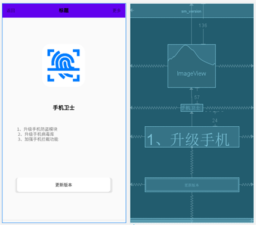

Activity代码：[VersionActivity.java](https://github.com/shaoyayu/securityButler/blob/master/app/src/main/java/icu/shaoyayu/android/security/butler/activity/VersionActivity.java)

Layout代码：[activity_version.xml](https://github.com/shaoyayu/securityButler/blob/master/app/src/main/res/layout/activity_version.xml)

下载任务的Task代码：[HttpDownloadTask.java](https://github.com/shaoyayu/securityButler/blob/master/presenter/src/main/java/icu/shaoyayu/android/security/presenter/service/HttpDownloadTask.java)

 

### 4.6、手机防盗模块的实现

#### 4.6.1、防盗界面

​    在防盗见面上，会检查当前设备是否开启防盗功能、是否激活系统管理员，如果激活管理员，激活管理员按钮就会隐藏起来，相反没有开启的时候就会显示。当前没有开启防盗的时候，设置联系人按钮会隐藏起来，用户点击上面开启防盗的开关进入防盗引导见面，相反用户设置好SIM卡的绑定和联系人的时候，按钮就会显示，为用户提供一个进入防盗见面。

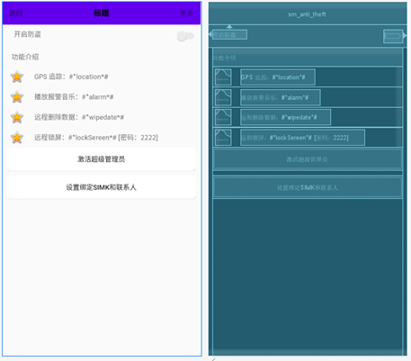

Activity代码：[AntiTheftActivity.java](https://github.com/shaoyayu/securityButler/blob/master/app/src/main/java/icu/shaoyayu/android/security/butler/activity/AntiTheftActivity.java)

Layout代码：[activity_anti_theft.xml](https://github.com/shaoyayu/securityButler/blob/master/app/src/main/res/layout/activity_anti_theft.xml)

 

#### 4.6.2、防盗设置引导界面

​    在引导防盗的GuideAntiTheftActivity中，启动的时候，程序会自动的检查当期是否拥有读取SIM卡信息和读取联系人权限，如果没有授权的话会通过动态授权方式来获取权限。GuideAntiTheftActivity中采用ViewPage组件添加一个适配器装载Fragment来实现引导。

​    第一个GuideAntiTheftOneFragment是手机防盗的相关介绍，第二个GuideAntiTheftTwoFragment是一个绑定SIM卡的见面，用户在这个地方点击开启绑定开关。开启绑定的时候需要用户来初始化一个防盗密码。关闭的时候也是要输入防盗密码。系统会保存SIM卡号，保存SIM的绑定是否绑定的状态、保存密码的MD5加密。第三个GuideAntiTheftThreeFragment使用来绑定联系人的。点击输入框或点击右侧的通讯录标识都会跳转到选择联系人模块，选择好的联系人会传递到当前的Activity中来。GuideAntiTheftActivity的onRestart()方法被调用的时候，重新初始化一次显示联系人的适配器，重新显示绑定联系人。

 
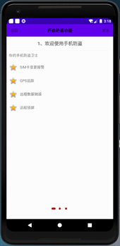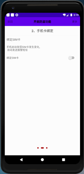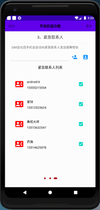

  

  

Activity代码：[GuideAntiTheftActivity.java](https://github.com/shaoyayu/securityButler/blob/master/app/src/main/java/icu/shaoyayu/android/security/butler/activity/GuideAntiTheftActivity.java)

Layout代码：[activity_guide_anti_theft.xml](https://github.com/shaoyayu/securityButler/blob/master/app/src/main/res/layout/activity_guide_anti_theft.xml)

ViewPage适配器中Fragment代码：

[GuideAntiTheftOneFragment.java](https://github.com/shaoyayu/securityButler/blob/master/app/src/main/java/icu/shaoyayu/android/security/butler/fragment/GuideAntiTheftOneFragment.java)和[fragment_guide_anti_theft_one.xml](https://github.com/shaoyayu/securityButler/blob/master/app/src/main/res/layout/fragment_guide_anti_theft_one.xml)

[GuideAntiTheftTwoFragment.java](https://github.com/shaoyayu/securityButler/blob/master/app/src/main/java/icu/shaoyayu/android/security/butler/fragment/GuideAntiTheftTwoFragment.java)和[fragment_guide_anti_theft_three.xml](https://github.com/shaoyayu/securityButler/blob/master/app/src/main/res/layout/fragment_guide_anti_theft_three.xml)

[GuideAntiTheftThreeFragment.java](https://github.com/shaoyayu/securityButler/blob/master/app/src/main/java/icu/shaoyayu/android/security/butler/fragment/GuideAntiTheftThreeFragment.java)和[fragment_guide_anti_theft_two.xml](https://github.com/shaoyayu/securityButler/blob/master/app/src/main/res/layout/fragment_guide_anti_theft_two.xml)

初始化密码弹窗[InitialPasswordDialog.java](https://github.com/shaoyayu/securityButler/blob/master/app/src/main/java/icu/shaoyayu/android/security/butler/dialog/InitialPasswordDialog.java)和布局文件：[dialog_initial_password.xml](https://github.com/shaoyayu/securityButler/blob/master/app/src/main/res/layout/dialog_initial_password.xml)

### 4.7、APP管理模块的实现

​    SoftwareManageActivity负责管理非系统的应用程序。这里的下拉刷新采用的Google开源控件SwipeRefreshLayout。进入到当前的活动的时候，会显示一个下拉刷新的动作，直到后台任务把非系统中的APP信息读取出来后，会关闭刷新动作。用户可以点击app条目，就会从底部弹出一个自定义对话框AppInfoBottomDialog，供用户选择APP管理的选项，可以运行程序，可以通过系统的分享功能分析给别人，可以直接卸载当前应用，但是卸载不了当前APP应用。

 

 

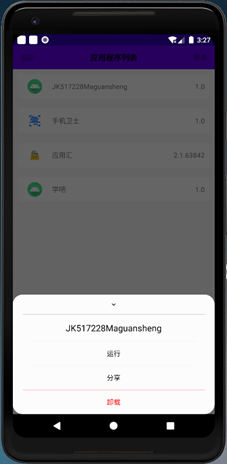

图 4-6-1

Activity代码：[SoftwareManageActivity.java](https://github.com/shaoyayu/securityButler/blob/master/app/src/main/java/icu/shaoyayu/android/security/butler/activity/SoftwareManageActivity.java)

Layout代码：[activity_software_manage.xml](https://github.com/shaoyayu/securityButler/blob/master/app/src/main/res/layout/activity_software_manage.xml)

AppInfoAdapter的布局文件：[adapter_app_manage_item.xml](https://github.com/shaoyayu/securityButler/blob/master/app/src/main/res/layout/adapter_app_manage_item.xml)

AppInfoBottomDialog代码：[AppInfoBottomDialog.java](https://github.com/shaoyayu/securityButler/blob/master/app/src/main/java/icu/shaoyayu/android/security/butler/dialog/AppInfoBottomDialog.java)

AppInfoBottomDialog的布局文件：[dialog_app_info.xml](https://github.com/shaoyayu/securityButler/blob/master/app/src/main/res/layout/dialog_app_info.xml)

### 4.8、自定义控件模块实现

​    这里使用一个开源环形进度条CircleProgressBar用来展示程序的每个检查任务后的系评分显示。源码地址：[CircleProgressBar.java](https://github.com/shaoyayu/securityButler/blob/master/app/src/main/java/icu/shaoyayu/android/security/butler/view/CircleProgressBar.java)

 

## 五、 程序测试

1、程序在运行的时候权限是已经注册了，并且在应用详情里面并且授予了权限。但是运行的时候还是会出现权限不足的问题。经过查阅Android 开发文档后得知，有些权限需要动态申请权限，第二次后询问权限的时候会出现不在提示授权的情况。需要给用户解释好权限用途，在打开应用详情让用户授权。程序涉及应用权限如下，本程序中我们使用easypermissions框架对权限进行管理。

```xml
<!-- 访问网络权限 -->
<uses-permission android:name="android.permission.INTERNET" /> <!-- 读写内存权限 -->
<uses-permission android:name="android.permission.READ_EXTERNAL_STORAGE" />
<uses-permission android:name="android.permission.WRITE_EXTERNAL_STORAGE" /> <!-- 获取SIM卡信息 -->
<uses-permission android:name="android.permission.READ_PHONE_STATE" /> <!-- 读取联系人权限 -->
<uses-permission android:name="android.permission.WRITE_CONTACTS" />
<uses-permission android:name="android.permission.READ_CONTACTS" />
<uses-permission android:name="android.permission.GET_ACCOUNTS" /> <!-- 手机开启监听 -->
<uses-permission android:name="android.permission.RECEIVE_BOOT_COMPLETED" /> <!--  发送消息 -->
<uses-permission android:name="android.permission.SEND_SMS" /> <!--  阅读消息 -->
<uses-permission android:name="android.permission.READ_SMS" /> <!--  写入消息 可能是版本问题 -->
<uses-permission android:name="android.permission.WRITE_SMS" /> <!-- 接收消息 -->
<uses-permission android:name="android.permission.RECEIVE_SMS" /> <!-- 获取位置信息 -->
<uses-permission android:name="android.permission.ACCESS_FINE_LOCATION" />
<uses-permission android:name="android.permission.ACCESS_COARSE_LOCATION" />

```

 

​    2、网络请求时候会出现安全问题，我们需要在清单文件中声明网络安全相关配置位置，如networkSecurityConfig，配置如下：

```xml
<application
    android:networkSecurityConfig="@xml/network_security_config"

```

​    在文件夹res下面创建一个xml文件夹，在xml文件夹下面编写一个network_security_config.xml文件，内容如下：

```xml
<?xml version="1.0" encoding="utf-8"?>
<network-security-config>
    <base-config cleartextTrafficPermitted="true" />
</network-security-config>

```

 

## 六、 总结

在本次课程设计中，增加自己对Android 开发的新认识，包括常见的一些列表控件，适配器，布局管理器，自定义组合组件的是认识和使用。还有API升级的过程中设计得到的一些开发方式的变化，权限，依赖管理和APK签名。

​    在API 23 的时候增加全新的权限机制，针对 Android 6.0 及以上系统版本开发的应用程序在使用敏感权限（如拍照、查阅联系人或短信）时需要先征求用户同意。可将内置存储空间与SD存储卡空间格式化，合并成一个存储空间。在API 29的时候 Android 10允许用户控制应用程序何时有权查所在位置。新增控制应用程序在后台时的照片、影片和音乐文件的访问权限。增加对后台应用程序自动唤醒到前台的限制。隐私改进：限制对IMEI码的读取。

​    了解MVP的开发模式，在开发的时候我们需要考虑的问题如：版本问题、手机厂商系统问题。在系统提供服务的时候，我们都要考虑这些问题。程序的健壮性、维护性和扩展性变得很重要。

